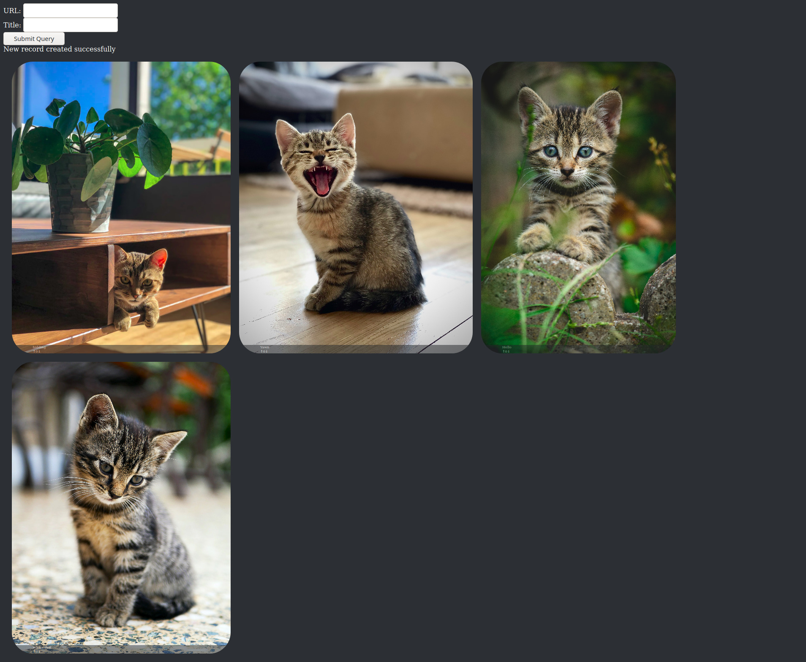

# CatImgDB
This is the source code repo for CatImgDB.  
CatImgDB is a image collection and rating website, similar to [Reddit](https://reddit.com/), for the collection and rating of Cat Images. CatImgDB is made with `LAMP`/`LEMP` (`Linux`,`Apache` or `NGINX`,`MySQL` (specifically `mariadb`,`PHP`) and unreleased.

## Why are you making this?
- To learn  
I've been wanting to learn `SQL` and `PHP` and making one big project is how I learn. I split it up into small parts and then
- To


## What is this
This is the code for a yet to be released website (due to security issues). This allows the collection and rating of images.

## Installation requirements:
You will need a web server, PHP, MySQL compatible Database Management System.

### Installation Recommendation:
- Web server
	`Apache` or `nginx`
	- Tested on `Apache` `2.4.46-3` web server
	- Tested on `nginx` `1.14.2` web server
- PHP
	`PHP` version `7.3.27` or higher
	- Tested on `PHP` `v7.4.10`
- MySQL compatible DBMS
	`MariaDB`
	- Tested on `MariaDB` `v10.5.5`
- Operating System
	`Debian` based `GNU + Linux` distro
	- Tested on `Manjaro Linux x86_64`
		- Kernel `GNU/Linux 5.9.16-1-MANJARO`
	- Tested on `Raspbian GNU/Linux 10 (buster) armv6`
		- Kernel `5.4.51+`

## How to install
1. login to your `SQL Manager` and add a new user
2. Make a new database, `[database]`
3. Run the SQL in `sql.sql` in the new database
4. Save the new users `[username]`, `[password]` in a file called  `pwd/[username].php` with the format:
```
<?php
$username = "[username]";
$password = "[password]";
?>
```
5. Save `pwd/[username].php` to the root directory of the web server
6. Copy `src/index.php` to the root directory of the web server
7. Find line:
```
//Password database info
require "pwd/haz.php";
$dbname = "test";
```
and change it to
```
//Password database info
require "pwd/[username].php";
$dbname = "[database]";
```
7. Connect to it through [localhost](http://localhost/index.php)


## FAQ
- Can this code be used for other pictures besides cats?  
Technically yes, we have not yet added are [CatID AI](#catid) yet so there is nothing stopping this code being used to build another image site.  
Officially **NO**. CatImgDB is only for cat images, it is in the title.
- Where can i access this site?  
Nowhere, upsettlingly this site is not yet public.
- Why is this site not public yet? When will it be?  
This site is not ready for public, this is due to security and quality issues.  
We have no time frame for when it will be public.
- How can I help?  
As I am doing this project to learn SQL I would really appreciate it if you would review my code for any bad practices and test it to find if there are any bugs.
- How will this be financially viable?  
Once are user-base is big enough we will introduce Cat-verts (cat advert), an advert with a cat in it that is also be rate-able, this will allow us to keep to our sole aim of collecting and rating all cat images in the world as the cat-vert will technically class-able as a cat image.
- What makes this better than other cat image sharing websites?  
It has a [plan](#todo).  
It has been designed to be [much better than competitors](#whybetter).  
Its main and only purpose is to be a `web database for cat images`.


## <span id="todo">To Do List</span>
### Done
- [x] URL Upload of Cat Image
- [x] Form for URL uploading
- [x] Displaying the DB

### Currently working on
- [ ] Rating system
- [ ] Reporting System
	- To get rid of anything that is not biologically a cat

### Plans for the future
- [ ] CatImgDB Account
- [ ] API
- [ ] Security
- [ ] Upload from computers

### Dreams
- [ ] Decentralize, allows multiple CatImgDB to communicate to expand DB.
- [ ] <span id="catid">CatID</span>
	- A AI program that has two tasks:
		- Identifies if something is a cat or not and then allow or mark it for approval.
		- Take over the world

## <span id="whybetter">Why is this better than all the competition?</span>
- CatImgDB sole aim is to collect and rate every cat image
	- [Instagram](https://www.instagram.com/), [Flickr](https://www.flickr.com/), [unsplash](https://Unsplash.com/) and other image websites are aimed at collection of all types of images, not just cat images, thus won't be as good.
	- [r/cats](https://www.reddit.com/r/cats/) is not solely aimed at the collection and rating of cat images but everything about cats.
- CatImgDB is distraction free, only cat images
	- [r/cats](https://www.reddit.com/r/cats/) and [r/kittens](https://www.reddit.com/r/kittens/) both allow text posts and videos, these are not Cat Images thus are distractions, thus inferior.
- CatImgDB provides a barrier-less experience, all you need is a title and a URL of a cat image
	- [r/cats](https://www.reddit.com/r/cats/) does not allow accounts less than 10 days old or have less than 50 karma to post, thus preventing the collection of cat images.

## Versions
### v0.1 [current]
It can currently take a URL with a title and add it to a SQL database.  
It can then show that database as a grid of pictures with title at the bottom. Its title will expand and become more visible when the picture is hovered over.

## Screenshot

Current cat pictures are from [unsplash](https://Unsplash.com/).
